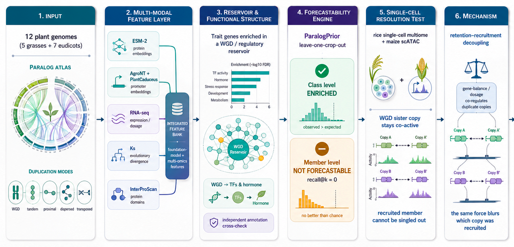

# Crop trait genes are drawn from a functionally structured but non-forecastable paralog reservoir

Reproducibility code and a small reusable assay for the manuscript of the same title.

The main result is a contrast. Whole-genome-duplication (WGD) paralogs are enriched among the cloned
crop trait genes, and the duplicate pool is functionally structured: WGD copies lean toward regulatory
genes (transcription factors, hormone signalling), while tandem and proximal copies lean toward defence
and metabolism. Even so, we could not predict which of the two duplicate copies was the one actually
recruited into the trait from any static feature we tried. So the signal is a class-level prior, not a
member-level one.



The figure shows the pipeline. We build a paralog atlas from 12 plant genomes, attach a feature layer
that mixes protein and DNA language-model embeddings (ESM-2 for proteins; AgroNT and PlantCaduceus for
promoters) with expression, Ks and InterProScan domains, run a cluster-robust enrichment test, and then a
leave-one-crop-out prediction step (ParalogPrior). The enrichment comes through clearly, but the recruited
copy stays unpredictable; single-cell data (rice multiome, maize scATAC) point the same way. We read it as
a side effect of dosage balance, which keeps the two copies co-regulated and similar.

## What this repository contains
- **`paralog_forecast/`** — a lightweight, reusable assay (a few plain modules, not a packaged
  product): cluster-robust WGD-vs-other enrichment + leave-one-group-out forecastability +
  learning curve + within-group oracle + prevalence-robust top-k / tie diagnostics. Runs on **your
  own** gene table.
- **`reproduce/`** — scripts that regenerate the manuscript's load-bearing numbers from the frozen
  inputs (data on Zenodo, not here).
- **`data/example/`** — a small **synthetic** table so you can run the assay in seconds.
- Meta: `environment.yml`, `LICENSE`, `CITATION.cff`, `config/`.

## What this repository does NOT contain
Large data (gene-level foundation `.parquet`, ESM embeddings `.npz`, FASTA, raw SRA, intermediate
outputs) and the manuscript/SI drafts. The data are archived on **Zenodo** (see *Data availability*).
The full working project is ~700 GB and is not version-controlled here.

## Quickstart — run the forecastability assay on your own data
```bash
conda env create -f environment.yml && conda activate paralog-forecast
python scripts/make_synthetic_example.py          # writes data/example/synthetic_gene_table.tsv
PYTHONPATH=$PWD python scripts/smoke_test_example.py
```
Your input is **one row per gene** with at least:

| column | meaning |
|--------|---------|
| `gene_id` | unique gene id |
| `group` | crop/species (used for leave-one-group-out) |
| `label` | 1 = trait/positive gene, 0 = background |
| `orthogroup` | cluster id for cluster-robust SEs |
| `is_wgd` | 1 if WGD-derived duplicate |
| `family_size` | duplicate/orthogroup family size |

Recommended extra columns: `dup_mode`, `function_class`, `age`, `is_duplicate`, `is_singleton`.
All column names are arguments, so you can map your own schema.

```python
import pandas as pd, paralog_forecast as pf
df = pd.read_csv("your_genes.tsv", sep="\t")
pf.validate_gene_table(df)
print(pf.cluster_robust_wgd_enrichment(df))                 # is WGD enriched among your trait genes?
preds, metrics, ties = pf.leave_one_group_out_forecast(df)  # can it forecast members across groups?
curve = pf.learning_curve_loco(df)                          # would more labels help (sparsity vs signal)?
```
**Read top-k with the prevalence ceiling in mind:** `recall@k` is denominator-deflated under class
imbalance; the honest metrics are `enrichment@k`, `top_0.01_enrichment`, `auprc_lift`, and the tie
diagnostic (discrete features tie large blocks at the top).

## Reproducing the manuscript analyses
1. Create the conda environment (above).
2. Download the frozen-input archive from Zenodo (*Data availability*).
3. `export PARALOG_ROOT=/path/to/unpacked/frozen_inputs` (or copy `config/config.example.yaml`
   to `config/config.yaml` and set `project_root`).
4. `PYTHONPATH=$PWD python reproduce/section_3_enrichment/run_enrichment.py`
   and `.../section_4_forecastability/run_forecastability.py`.

These drivers call the same `paralog_forecast/` code, so they are also worked real-data examples.

## Data availability
Frozen inputs (gene-level paralog foundation, cloned-trait catalogue, locked result tables) and the
larger derived data are archived at **Zenodo: DOI [`10.5281/zenodo.20669687`](https://doi.org/10.5281/zenodo.20669687)**. The raw
genomes/annotations come from their original public sources (PLAZA, RAP-DB, MaizeGDB, SGN, SoyBase,
AraGWAS, and the cited selection-sweep studies); see the manuscript Methods.

## Reusable components
This repo packages, in `paralog_forecast/`, the genuinely reusable parts of the study:
1. feature construction from paralog annotations,
2. cluster-robust WGD/duplicate enrichment,
3. leave-one-group-out ParalogPrior **forecastability assay** (the paper's central instrument),
4. prevalence-robust top-k + learning-curve + tie diagnostics.
It is intentionally **not** a full software product (no CLI/CI/docs-site); it is a small importable
module you can drop into your own analysis.

## Environment
conda base tested with Python 3.12, numpy 2.3.5, pandas 3.0, statsmodels 0.14, scikit-learn,
scipy 1.17, matplotlib. Outputs are TSV/CSV to minimise version drift.

## License and citation
Code: MIT (`LICENSE`). Small derived tables/docs: CC BY 4.0. Large data: see the Zenodo record.
Please cite the manuscript and the archived Zenodo release (`CITATION.cff`).

## Status
Pre-submission. Author: Shipeng Yang (ORCID and affiliation to be added before publication). GitHub:
`https://github.com/Shipeng-Yang/Paralog-reservoir`. Code and frozen inputs are archived on Zenodo
(concept DOI [`10.5281/zenodo.20669687`](https://doi.org/10.5281/zenodo.20669687), resolving to the
latest version); the article DOI is pending. The manuscript and Supplementary Information are not
included here until acceptance.
